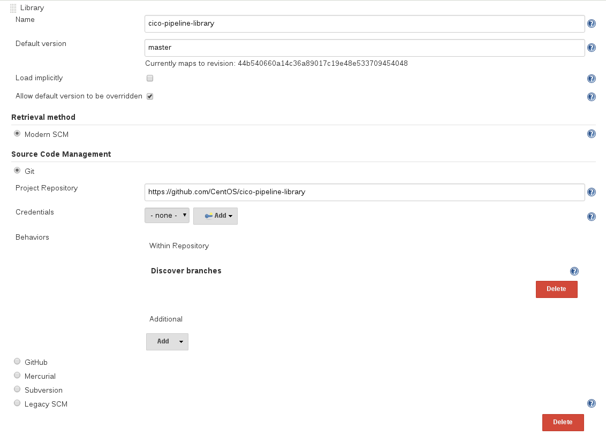

# CentOS CI Jenkins Pipeline Shared Libraries

Shared Library and example code to use Jenkinsfiles based Jenkins Pipelines in 
[ci.centos.org](https://ci.centos.org)

## Pre-requisites 

* Jenkins 2.30+
* [Pipeline Shared Libraries](https://github.com/jenkinsci/workflow-cps-global-lib-plugin) plugin
* Other plugins may be required for specific library calls (i.e. Docker)

## Usage of Shared Libraries

### Option 1 - Global Configuration
   Add global library 'cico-pipeline-library' pointing to github location [https://github.com/CentOS/cico-pipeline-library](https://github.com/CentOS/cico-pipeline-library) <br> 
   in (Manage Jenkins > Configure System > Global Pipeline Libraries)
   
   Add `@Library('cico-pipeline-library') _` into your Jenkinsfile pipeline file
   
### Option 2 - Dynamically Load the Library
   Add `@Library('github.com/CentOS/cico-pipeline-library@master') _` 
   into your Jenkins pipeline file to dynamically load the library. <br>
   
_Note: You can also specify a specify path for libraries insteaf of _ like
      `import org.centos.*`_
      
### More General Information: 
   1. https://github.com/jenkinsci/workflow-cps-global-lib-plugin
   2. https://jenkins.io/doc/book/pipeline/shared-libraries/
   

## Examples

### Basic Library Example

#### vars/ciPipeline.groovy
```
import org.centos.Utils

import org.centos.Utils

def call(body) {

    def config = [:]
    body.resolveStrategy = Closure.DELEGATE_FIRST
    body.delegate = config
    body()

    def getDuffy = new Utils()
    def pipelineProps = ''
    try {
        def current_stage = 'cico-pipeline-lib-stage1'
        stage(current_stage) {
            writeFile file: "${env.WORKSPACE}/job.properties",
                    text: "MYVAR1=test\n" +
                          "MYVAR2=3\n"
        }
        current_stage = 'cico-pipeline-lib-stage2'
        stage(current_stage) {
            // Convert a classic shell properties file to groovy format to be loaded
            pipelineProps = convertProps("${env.WORKSPACE}/job.properties")
            // Load these as environment variables into the pipeline
            load(pipelineProps)
            sh '''
                echo "Original Shell Properties File:"
                cat ${WORKSPACE}/job.properties
                echo ""
                echo "Groovy Properties File:"
                cat ${WORKSPACE}/job.properties.groovy
                echo "Environment Variables"
                env
            '''
        }
    } catch (err) {
        echo "Error: Exception from " + current_stage + ":"
        echo err.getMessage()
        throw err
    }
}
```

#### Jenkinsfile
```
@Library('github.com/CentOS/cico-pipeline-library@master') _

node {
    deleteDir()
    ciPipeline { }
}
```